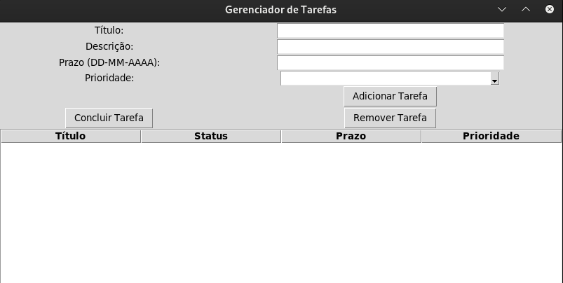

# 🚀 Gerenciador de Tarefas

Uma aplicação desktop simples e eficaz, construída com **Tkinter** em Python, para organização e acompanhamento de tarefas pessoais e profissionais, com persistência de dados em formato **JSON**.

---

## 📸 Interface do Usuário

A aplicação apresenta um design limpo, com campos claros para a entrada de dados e uma tabela (`ttk.Treeview`) para visualização rápida das tarefas, status, prazos e prioridades.




---

## ✨ Visão Geral e Recursos Principais

Este projeto implementa um sistema de Gerenciamento de Tarefas (`Task Manager`) com uma interface gráfica intuitiva (GUI). Ele permite aos usuários adicionar, visualizar, concluir e remover tarefas, garantindo a persistência dos dados entre as sessões.

### Recursos (Features)

* ✅ **Criação e Detalhamento de Tarefas:** Adiciona tarefas com Título, Descrição, Prazo e Prioridade.
* 🚦 **Sistema de Prioridade e Status:** Utiliza classes `Enum` para prioridades (`baixa`, `média`, `alta`) e múltiplos status de acompanhamento (`pendente`, `concluída`, `atrasada`, etc.).
* 💾 **Persistência de Dados (JSON):** As tarefas são automaticamente salvas no arquivo `tasks.json` ao adicionar, remover ou concluir, e carregadas na inicialização.
* 🖼️ **Interface Gráfica (Tkinter):** Utiliza `tkinter` para a construção da interface, com `ttk.Treeview` para exibir a lista de tarefas de forma organizada.

---

## 🛠️ Pré-requisitos e Instalação

### Requisitos

* **Python 3.x**
* O projeto utiliza apenas bibliotecas nativas do Python (`tkinter`, `json`, `datetime`, `enum`), portanto, **não é necessário instalar dependências adicionais** com `pip`.

### Como Executar

1.  Baixe ou clone o repositório, garantindo que o arquivo `main.py` esteja salvo em seu computador.
2.  Execute o script diretamente via terminal:

    ```bash
    python main.py
    ```

3.  A janela do Gerenciador de Tarefas será exibida. O arquivo `tasks.json` (usado para salvar suas tarefas) será criado automaticamente após a primeira tarefa ser adicionada.

---

## 📐 Detalhes da Arquitetura e do Código

O projeto é estruturado em classes para promover modularidade e clareza, seguindo bons princípios de programação orientada a objetos (POO).

### Estrutura de Classes

| Classe | Propósito |
| :--- | :--- |
| **`Task`** | Representa uma única tarefa e sua lógica de negócio (concluir, checar atraso, editar). |
| **`TaskManager`** | Gerencia a lista completa de tarefas e a lógica de persistência (`saveTasks`, `loadTasks`). |
| **`PriorityEnum`** | Define e padroniza os níveis de prioridade (`low`, `medium`, `high`). |
| **`StatusEnum`** | Define e padroniza os estados de acompanhamento (`pending`, `concluded`, `delayed`, etc.). |

### Persistência de Dados

A persistência é garantida pela conversão entre objetos `Task` e estruturas de dicionário (JSON).

* Os métodos estáticos `toDict()` e `fromDict()` na classe `Task` são responsáveis por mapear os valores de `Enum` (como `StatusEnum.concluded`) para strings legíveis em JSON (como `"concluída"`) e vice-versa, garantindo que os dados sejam salvos e carregados sem perda de contexto.

---

## 💡 Próximos Passos e Contribuições

Sinta-se à vontade para utilizar, modificar e expandir este projeto! Sugestões de melhoria (Pull Requests) são bem-vindas, especialmente nas seguintes áreas:

1.  **Edição de Tarefas:** Implementar uma função `editTaskGUI` para modificar título, descrição, prazo ou prioridade de tarefas existentes.
2.  **Validação de Data:** Adicionar validação robusta no `entryDeadline` para garantir que o formato `DD-MM-AAAA` seja respeitado e que a data seja válida.
3.  **Filtragem na Tabela:** Adicionar controles na GUI para filtrar a lista de tarefas por `Status` (Ex: Mostrar apenas 'pendentes' ou 'atrasadas').